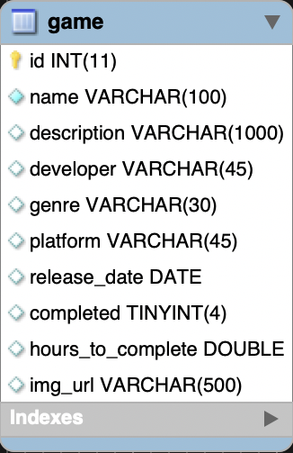

## Event Tracker Project

### Week 12 Homework Project for Skill Distillery

### Overview
The assignment this week was to create an event tracking application that was able to track some sort of event through time. I was tasked with creating a table, designing the associated POJO entity class, using Spring Data JPA repositories and services, and creating a controller that implemented REST. Users should be able to access full CRUD through Postman, using REST endpoints.

### Technologies/Topics Applied
This project required the knowledge and usage of technologies including Spring MVC, Spring Data JPA, JSON, Postman, MySQLWorkbench and more.

### About My Project
I chose to create a tracker that tracks video games a user has played, along with whether they've completed the game they entered, and how many hours it took them to finish the game. Users must enter a name for the game, and can optionally enter information like the game's developer, release date and genre. A table representing the "game" entity I used is below.

### Accessing and Using This Project
Currently, this project is hosted on AWS and can be accessed at **http://3.16.88.147:8080/EventTracker/api/games**. The operations that can be performed with this project and the URIs to access these operations are listed below.

| CRUD Op. | HTTP Verb | URI               | Action                                     |
|----------|-----------|-------------------|--------------------------------------------|
| Read     | GET       | `/api/games`      |Displays a list of all games in the tracker |
| Read     | GET       | `/api/games/{id}` |Displays the game with matching ID          |
| Create   | POST      | `/api/games`      |Creates a game and adds it to the tracker   |
| Update   | PUT       | `api/games/{id}`  |Updates an existing game's information      |
| Delete   | DELETE    | `/api/games/{id}` |Deletes a game from the tracker             |

*\*substitute {id} for any valid integer representing an item in the tracker database*

### Lessons Learned
I found this project to be an effective means of reinforcing the use of Spring Data JPA and REST, which I'd just began learning about. They are both powerful tools, and in doing this project, I learned just how they can simplify the process of getting a full stack web application off the ground quickly.

### Stretch Goals
I plan to flesh this project out much more, so that it eventually includes functionality like showing average gameplay times for a game, fields that represent *how* a user has played a game, and user ratings for games that can be used alongside average play time to suggest games users may enjoy.
